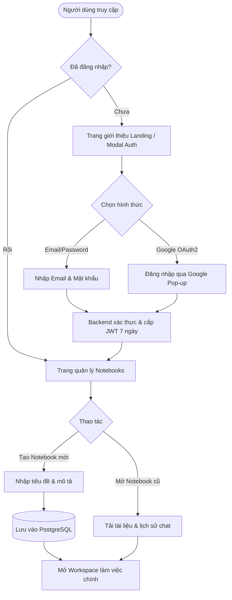
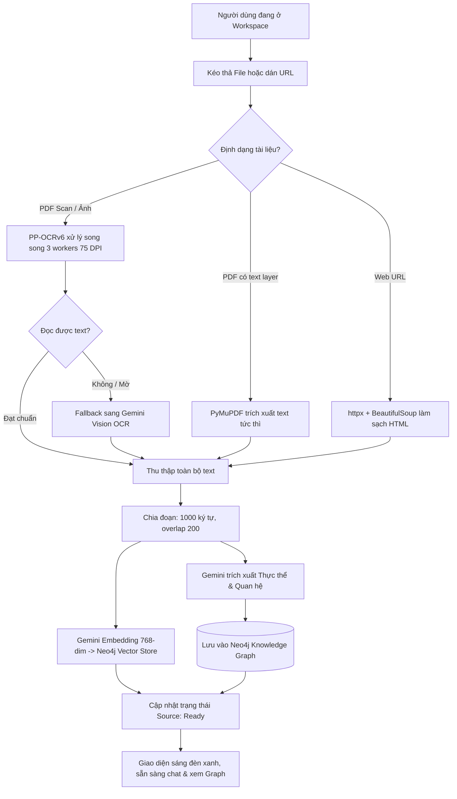

# Chương 4. AI trong Thiết kế Sản phẩm
## Dự án: Skibidi — Nền Tảng Trích Xuất & Hỏi Đáp Tài Liệu Thông Minh

> **Skibidi** là hệ thống hỏi đáp và tóm tắt tài liệu thông minh kết hợp **GraphRAG**, **OCR đa mô hình PP-OCRv6**, và **Google Gemini AI** — xây dựng theo kiến trúc full-stack hiện đại (Next.js 15 + FastAPI + Neo4j + PostgreSQL).
> 
> Chương này trình bày chi tiết quy trình ứng dụng Trí tuệ Nhân tạo (AI) vào việc thiết kế trải nghiệm người dùng (UX) và giao diện người dùng (UI), bao gồm: Luồng người dùng (User Flow), Bố cục khung (Wireframing), Bản mẫu tương tác (Prototyping), và Đánh giá thiết kế bằng AI (AI Design Review).

---

## 4.1 Luồng Người dùng (User Flow)

### 4.1.1 Bối cảnh & Phương pháp Thiết kế Luồng với AI

Trong các ứng dụng tra cứu tài liệu truyền thống hoặc các công cụ RAG thông thường (như Nextjs-RAG-Notebook, ChatPDF), luồng người dùng thường bị phân mảnh và thụ động:
1. Người dùng tải file lên nhưng không nắm được tiến trình OCR phức tạp bên dưới.
2. Quá trình tra cứu chỉ là hỏi - đáp đơn điệu từng câu mà không thể bao quát toàn bộ cấu trúc liên kết tri thức (Knowledge Graph) của tài liệu.
3. Thiếu khả năng phục hồi tự động khi gặp tài liệu chất lượng thấp (ví dụ: PDF scan mờ, văn bản đa cột).

Nhóm phát triển đã ứng dụng **Google Gemini 2.5 Flash** để phân tích hành trình người dùng (User Journey Mapping), mô phỏng các tình huống thực tế của sinh viên và nhà nghiên cứu, từ đó thiết kế các luồng người dùng tối ưu hóa:
* **Giảm thiểu số thao tác (Fewer Clicks):** Tự động chuyển trạng thái từ Upload $\rightarrow$ OCR $\rightarrow$ Embedding $\rightarrow$ Sẵn sàng chat mà không cần người dùng cấu hình thủ công.
* **Tương tác song song (Dual-view Interaction):** Vừa có thể hỏi đáp qua hộp thoại Chat (trực quan hóa dạng văn bản), vừa có thể chạm vào Đồ thị tri thức (trực quan hóa dạng không gian).
* **Phản hồi thời gian thực (Real-time Feedback):** Mọi tác vụ dài (OCR, sinh câu trả lời) đều được truyền dữ liệu liên tục qua Server-Sent Events (SSE) và chỉ báo trạng thái rõ ràng.

---

### 4.1.2 Các Luồng Người dùng Cốt lõi (Core User Flows)

#### Luồng 1: Xác thực & Khởi tạo Không gian làm việc (Auth & Notebook Setup)

Luồng này bảo đảm quyền riêng tư của tài liệu và cho phép phân chia ngữ cảnh theo từng đồ án/môn học riêng biệt.



---

#### Luồng 2: Nạp và Xử lý Đa dạng Tài liệu (Multi-format Ingestion Pipeline Flow)

Luồng thể hiện năng lực nổi bật của Skibidi khi xử lý song song nhiều định dạng với động cơ OCR PP-OCRv6:



---

#### Luồng 3: Hỏi Đáp Đồ Thị Tri Thức GraphRAG (Streaming GraphRAG Chat Flow)

Đây là tính năng cốt lõi tạo nên sự khác biệt giữa Skibidi và các công cụ RAG thông thường:

```mermaid
flowchart TD
    UserQuery[Người dùng nhập câu hỏi vào Chat] --> SendChat[Gửi POST /chat]
    SendChat --> QueryEmbed[Tạo Embedding cho câu hỏi 768-dim]
    
    QueryEmbed --> Neo4jVector[Tìm top-5 Chunks tương đồng cao nhất]
    Neo4jVector --> TraverseKG[Duyệt quan hệ Entity liên kết với các Chunk]
    
    TraverseKG --> BuildContext[Ghép Context: Đoạn trích văn bản + Quan hệ Đồ thị]
    BuildContext --> SendGemini[Gửi Context & Lịch sử tới Gemini 2.5 Flash]
    
    SendGemini --> SSEStream[Khởi tạo luồng SSE - Server-Sent Events]
    SSEStream --> StreamSources[Phát sự kiện: Danh sách nguồn tài liệu trích dẫn]
    StreamSources --> StreamTokens[Phát từng Token chữ theo thời gian thực]
    StreamTokens --> RenderText[Giao diện hiển thị hiệu ứng đánh máy mượt mà]
    StreamTokens --> CompleteStream[Nhận tín hiệu hoàn thành [DONE]]
    CompleteStream --> SaveHistory[(Lưu câu hỏi & trả lời vào PostgreSQL)]
```

---

#### Luồng 4: Khám phá & Tương tác Đồ thị Tri thức (Interactive Knowledge Graph Flow)

Cho phép người dùng tương tác trực tiếp bằng thị giác với các khái niệm được trích xuất từ tài liệu:

```mermaid
flowchart TD
    ClickTab[Người dùng chọn tab 'Knowledge Graph'] --> FetchGraph[Gọi GET /api/notebooks/{id}/graph]
    FetchGraph --> CheckNodes{Có thực thể không?}
    
    CheckNodes -- Rỗng --> ShowEmpty[Hiển thị thông báo: Chưa có đủ thực thể]
    CheckNodes -- Có dữ liệu --> Render2D[Khởi tạo canvas 2D bằng react-force-graph-2d]
    
    Render2D --> InteractiveActions{Hành động của người dùng}
    InteractiveActions -- Zoom / Pan --> TransformCanvas[Phóng to, thu nhỏ, cuộn vùng nhìn]
    InteractiveActions -- Kéo thả Node --> RepositionNode[Lực vật lý định vị lại các liên kết]
    InteractiveActions -- Hover chuột vào Node --> Tooltip[Hiển thị Tooltip: Tên thực thể, Phân loại]
    InteractiveActions -- Click vào Node --> HighlightRel[Làm nổi bật các cạnh quan hệ nối tới thực thể]
```

---

### 4.1.3 Phân tích Nhánh Lỗi & Phục Hồi (Error Handling & Edge Cases)

Dưới sự hỗ trợ của AI phân tích rủi ro, hệ thống dự trù các kịch bản ngoại lệ để đảm bảo trải nghiệm không bị ngắt quãng:

| Tình huống ngoại lệ | Nguy cơ | Cơ chế tự phục hồi của Skibidi |
|---|---|---|
| **PDF scan chất lượng quá kém / viết tay** | PP-OCRv6 nhận diện dưới 10 ký tự hoặc sai lệch nghiêm trọng | Tự động chuyển hướng sang **Gemini Vision** để đọc ngữ cảnh hình ảnh sâu; nếu vẫn thất bại, gắn cờ `status: failed` kèm thông báo chi tiết cho người dùng. |
| **Tài liệu rỗng hoặc URL chặn bot** | Gây nghẽn tiến trình trích xuất | Parser trả về thông báo lỗi thân thiện: *"Không thể đọc nội dung từ liên kết này, vui lòng copy nội dung trực tiếp"*. |
| **Mất kết nối mạng giữa chừng (SSE Chat)** | Mất phản hồi đang sinh của AI | Client tự động phát hiện `EventSource error`, giữ nguyên phần văn bản đã nhận được và hiển thị nút **"Thử lại" (Retry)**. |
| **Token hết hạn (JWT Expired)** | Người dùng bị từ chối truy cập đột ngột | Trình interceptor của `authFetch` tự động bắt mã `401 Unauthorized`, hiển thị modal đăng nhập lại mà không làm mất văn bản đang soạn thảo. |

---

## 4.2 Bố cục Khung (Wireframing)

### 4.2.1 Triết lý Thiết kế Giao diện (Design Philosophy)

* **Mô hình Phân tách 3 Khối (Tri-Pane Layout):** Lấy cảm hứng từ Google NotebookLM nhưng nâng cấp không gian:
  * **Cột trái:** Quản lý tài liệu nguồn (Sources Explorer) & Nút nạp dữ liệu.
  * **Cột giữa / Khối làm việc trung tâm:** Khung hội thoại AI thông minh (Conversational Stream) với đầy đủ trích dẫn nguồn.
  * **Cột phải / Tab trực quan:** Đồ thị tri thức (Knowledge Graph Explorer) hiển thị cấu trúc thực thể.
* **Tối giản & Đẳng cấp (Sleek Dark Theme):**
  * Nền tối dịu mắt (`#0d0e0f`, `#141517`) giảm mỏi mắt cho sinh viên và nhà nghiên cứu khi đọc tài liệu nhiều giờ.
  * Gam màu điểm nhấn hiện đại: Tím Indigo (`#4f46e5`), Xanh Cyan (`#06b6d4`), kết hợp viền mờ Glassmorphism (`rgba(255, 255, 255, 0.08)`).
* **Độ tương phản cao & Font chữ tối ưu:**
  * Sử dụng bộ font **Inter** hỗ trợ dấu tiếng Việt chuẩn xác và độ sắc nét cao trên màn hình Retina / 4K.

---

### 4.2.2 Kiến trúc Wireframe Chi Tiết

#### WF-01: Màn hình Đăng nhập & Xác thực (Auth Modal & Landing Screen)

Màn hình chào mừng nêu bật định vị công nghệ GraphRAG + PP-OCRv6 kèm phương thức đăng nhập linh hoạt:

```text
+-----------------------------------------------------------------------------------+
|  [Logo Skibidi]  Skibidi — Trích Xuất & Hỏi Đáp Tài Liệu              [ Đăng nhập ]|
+-----------------------------------------------------------------------------------+
|                                                                                   |
|                   ✨ Powered by Gemini 2.5 Flash + GraphRAG                       |
|                                                                                   |
|           HIỂU SÂU MỌI TÀI LIỆU VỚI ĐỒ THỊ TRI THỨC VÀ OCR THẾ HỆ MỚI             |
|                                                                                   |
|      Không chỉ vector search thông thường — Skibidi xây dựng Knowledge Graph      |
|           từ PDF, ảnh scan và web để giải đáp chính xác, đa chiều.                |
|                                                                                   |
|                           [ Bắt Đầu Ngay Miễn Phí ]                               |
|                                                                                   |
|       +-------------------+  +--------------------+  +--------------------+       |
|       | 📄 PP-OCRv6       |  | 🧠 GraphRAG        |  | ⚡ Gemini 2.5      |       |
|       | Đọc cả PDF scan & |  | Hiểu quan hệ giữa  |  | Streaming cực      |       |
|       | ảnh tiếng Việt    |  | các thực thể       |  | nhanh < 3s         |       |
|       +-------------------+  +--------------------+  +--------------------+       |
+-----------------------------------------------------------------------------------+
| MODAL ĐĂNG NHẬP / ĐĂNG KÝ:                                                        |
|   +-----------------------------------------------------------------------+       |
|   |  Đăng nhập Skibidi                                                [X] |       |
|   |                                                                       |       |
|   |  [ G  Đăng nhập bằng tài khoản Google ]                               |       |
|   |  --------------------------- HOẶC ----------------------------------- |       |
|   |  Email:    [ nguyenvan@example.com                                  ] |       |
|   |  Mật khẩu: [ ••••••••••••••••                                       ] |       |
|   |                                                                       |       |
|   |  [               Đăng Nhập Vào Hệ Thống                 ]             |       |
|   |  Chưa có tài khoản? [Đăng ký tài khoản mới]                           |       |
|   +-----------------------------------------------------------------------+       |
+-----------------------------------------------------------------------------------+
```

---

#### WF-02: Bảng Điều Khiển Quản Lý Notebook (Notebooks Dashboard)

Nơi người dùng quản lý các đề tài nghiên cứu, môn học hoặc đồ án riêng biệt:

```text
+-----------------------------------------------------------------------------------+
| [Logo] Skibidi  |  Không gian làm việc               [Tìm kiếm...] [User Avatar v]|
+-----------------------------------------------------------------------------------+
|                                                                                   |
|  Tủ Sách Tài Liệu Của Tôi                                      [ + Tạo Notebook ] |
|                                                                                   |
|  +---------------------------+  +---------------------------+  +----------------+ |
|  | 📁 Luận văn Tốt nghiệp N4 |  | 📁 Chuyên đề GraphRAG     |  | 📁 Học Máy KTPM| |
|  | 12 tài liệu • 48 ghi chú  |  | 4 tài liệu • 16 ghi chú   |  | 8 tài liệu     | |
|  | Cập nhật: 10 phút trước   |  | Cập nhật: 2 giờ trước     |  | Hôm qua        | |
|  | [ Mở ra ]       [Xóa (Thùng rác)] | [ Mở ra ]        [Xóa]      | [ Mở ra ] [Xóa]| |
|  +---------------------------+  +---------------------------+  +----------------+ |
|                                                                                   |
+-----------------------------------------------------------------------------------+
```

---

#### WF-03: Không Gian Làm Việc Chính (Main Notebook Workspace)

Bố cục 3 khối linh hoạt cho phép người dùng thao tác song song giữa Nguồn - Chat - Đồ thị tri thức:

```text
+------------------------------------------------------------------------------------------------------------+
| [<- Quay lại]  📁 Chuyên đề GraphRAG  •  Trạng thái: [ Sẵn sàng ]               [Tab Chat] [Tab Graph]     |
+------------------------------------+-----------------------------------------------------------------------+
| CỘT TRÁI: NGUỒN TÀI LIỆU           | CỘT CHÍNH: KHUNG HỘI THOẠI AI (STREAMING CHAT)                        |
|                                    |                                                                       |
| [+ Thêm Nguồn Tài Liệu]            |  [AI Avatar]                                                          |
| ---------------------------------- |  Chào bạn! Tôi đã phân tích xong 2 tài liệu trong notebook này.      |
| [Kéo thả PDF / Scan / Ảnh / URL]   |  Bạn có thể hỏi bất kỳ câu hỏi nào hoặc khám phá Đồ thị Tri thức.    |
|                                    |                                                                       |
| Danh sách nguồn (2):               |  [User Avatar]                                                        |
|                                    |  Mối quan hệ giữa PP-OCRv6 và mô hình Gemini 2.5 là gì?               |
| [📄] Giao-trinh-AI-Scan.pdf        |                                                                       |
|      Trạng thái: [✓ Sẵn sàng]      |  [AI Avatar]                                                          |
|      Đã quét 25 trang (PP-OCRv6)   |  Dựa trên tài liệu bạn đã cung cấp:                                   |
|      [Xem trước]   [Xóa]           |  1. **PP-OCRv6** đóng vai trò là động cơ trích xuất quang học đầu     |
|                                    |     vào, chuyển đổi các trang PDF scan thành các đoạn văn bản...      |
| [🌐] https://arxiv.org/...         |  2. Sau đó, **Gemini 2.5 Flash** tiếp nhận các chunk văn bản này để   |
|      Trạng thái: [✓ Sẵn sàng]      |     xây dựng đồ thị thực thể và tổng hợp câu trả lời đa chiều. ▌       |
|      [Xem trước]   [Xóa]           |                                                                       |
|                                    |  Nguồn trích dẫn:                                                     |
|                                    |  [Pill: Giao-trinh-AI-Scan.pdf #Trang 3]  [Pill: Arxiv-Paper #Mục 2]  |
|                                    |                                                                       |
|                                    |  +-----------------------------------------------------------------+  |
|                                    |  | Nhập câu hỏi về tài liệu của bạn... (Enter để gửi)         [Gửi]|  |
|                                    |  +-----------------------------------------------------------------+  |
+------------------------------------+-----------------------------------------------------------------------+
```

---

#### WF-04: Màn Hình Trực Quan Hóa Knowledge Graph (Graph Tab View)

Khi chuyển sang tab **Knowledge Graph**, cột chính biến thành canvas đồ thị 2D tương tác:

```text
+------------------------------------------------------------------------------------------------------------+
| [<- Quay lại]  📁 Chuyên đề GraphRAG                                           [Tab Chat] [*Tab Graph*]   |
+------------------------------------+-----------------------------------------------------------------------+
| BỘ LỌC THỰC THỂ (FILTERS):         | KHÔNG GIAN ĐỒ THỊ 2D TƯƠNG TÁC (REACT-FORCE-GRAPH-2D)                 |
|                                    |                                                                       |
| [v] Người (Person)       [● Xanh]  |            (PP-OCRv6) ────[TĂNG TỐC 5.2X]───> (CPU OpenVINO)          |
| [v] Tổ chức (Org)        [● Lá]    |                 │                                                     |
| [v] Khái niệm (Concept)  [● Vàng]  |             [TÍCH HỢP]                                                |
| [v] Sự kiện (Event)      [● Đỏ]    |                 │                                                     |
|                                    |                 v                                                     |
| Thống kê đồ thị:                   |           (Skibidi RAG) ───[TRÍCH XUẤT]───> (Knowledge Graph)         |
| - 24 Thực thể (Nodes)              |                 │                                     │               |
| - 38 Mối quan hệ (Edges)           |             [SỬ DỤNG]                           [LƯU TRỮ]             |
|                                    |                 v                                     v               |
| Hướng dẫn:                         |         (Gemini 2.5 Flash) <────────────────────── (Neo4j 5.12)       |
| - Lăn chuột: Phóng to / Thu nhỏ    |                                                                       |
| - Kéo chuột: Di chuyển góc nhìn    | [TOOLTIP KHI HOVER]:                                                  |
| - Nhấp Node: Xem chi tiết liên kết | Thực thể: Gemini 2.5 Flash | Loại: AI Model | Xuất hiện: 14 lần       |
+------------------------------------+-----------------------------------------------------------------------+
```

---

### 4.2.3 Hệ Thống Lưới & Tính Đáp Ứng (Responsive Grid System)

Giao diện được thiết kế theo chuẩn hệ thống lưới linh hoạt (Fluid Grid System), tự động thích ứng trên 3 ngưỡng màn hình:

| Thiết bị / Kích thước | Điểm ngắt (Breakpoint) | Bố cục hiển thị |
|---|---|---|
| **Desktop / Màn hình lớn** | $\ge 1280\text{px}$ (`xl`, `2xl`) | Hiển thị đầy đủ 3 cột song song (Sidebar 280px, Sources Panel 320px, Khối làm việc chính chiếm toàn bộ chiều rộng còn lại). |
| **Laptop tiêu chuẩn** | $1024\text{px} - 1279\text{px}$ (`lg`) | Sidebar thu nhỏ thành dạng icon; Sources Panel có thể đóng/mở dạng Drawer trượt; Chat và Graph chuyển đổi linh hoạt qua Tab bar. |
| **Tablet & Mobile** | $< 1024\text{px}$ (`md`, `sm`) | Bố cục 1 cột duy nhất; Sources và cài đặt được đặt vào thanh điều hướng bên dưới (Bottom Navigation Sheet); ưu tiên tối đa diện tích cho màn hình gõ chat. |

---

## 4.3 Tạo Bản Mẫu (Prototyping)

### 4.3.1 Hệ Thống Thiết Kế (Design System & Design Tokens)

Để giao diện đạt độ hoàn thiện cao (High-fidelity) và tạo ấn tượng chuyên nghiệp, hệ thống áp dụng bảng Design Tokens tiêu chuẩn:

#### Bảng màu (Color Tokens)
* **Màu nền hệ thống:**
  * `var(--bg)`: `#0d0e0f` (Nền sâu tối)
  * `var(--surface-1)`: `#141517` (Nền panel & card)
  * `var(--surface-2)`: `#1a1b1e` (Nền hover & ô nhập liệu)
  * `var(--surface-3)`: `#25262b` (Bong bóng chat & thanh phân cách)
* **Màu sắc thương hiệu & Trạng thái:**
  * `var(--primary)`: `#4f46e5` (Tím Indigo công nghệ)
  * `var(--primary-hover)`: `#4338ca`
  * `var(--accent)`: `#06b6d4` (Xanh Cyan điểm nhấn)
  * `var(--success)`: `#22c55e` (Tài liệu sẵn sàng)
  * `var(--warning)`: `#f59e0b` (Đang OCR / Chờ xử lý)
  * `var(--danger)`: `#ef4444` (Lỗi xử lý file)
* **Bảng màu phân loại Node Đồ thị Tri thức:**
  * `Person`: `#748ffc` (Xanh dương nhạt)
  * `Organization`: `#69db7c` (Xanh lá)
  * `Concept`: `#ffd43b` (Vàng kim)
  * `Location`: `#ff8787` (Đỏ san hô)
  * `Event`: `#f783ac` (Hồng thạch anh)

#### Kiểu chữ (Typography)
* Font chữ chủ đạo: `Inter, -apple-system, BlinkMacSystemFont, 'Segoe UI', Roboto, sans-serif`.
* Thang kích cỡ chữ (Type Scale):
  * `Display Title`: 32px / Bold / Line-height: 1.2
  * `Section Heading`: 20px / Semi-bold / Line-height: 1.3
  * `Body Text`: 14px / Regular / Line-height: 1.6
  * `Caption & Metadata`: 12px / Medium / Line-height: 1.4

---

### 4.3.2 Hiện Thực Hóa Bản Mẫu Tương Tác Trên Next.js 15

Bản mẫu tương tác được cấu trúc trực tiếp vào mã nguồn Frontend bằng các component React 19 tái sử dụng:

| Thành phần giao diện | File mã nguồn | Chức năng tương tác chính |
|---|---|---|
| **Bộ khung ứng dụng** | `frontend/app/page.jsx` | Quản lý điều hướng SPA, kiểm tra phiên đăng nhập, đóng/mở Drawer nguồn và chuyển đổi Tab Chat/Graph. |
| **Hộp thoại xác thực** | `frontend/components/AuthModal.jsx` | Chuyển đổi tab Đăng nhập/Đăng ký, kiểm tra regex email, tương tác Google OAuth2 ID token. |
| **Khung chat tương tác** | `frontend/components/ChatInterface.jsx` | Đọc luồng SSE Streaming, hiển thị con trỏ nhấp nháy, tự động cuộn (Auto-scroll), sao chép câu trả lời (Copy to clipboard). |
| **Đồ thị tri thức 2D** | `frontend/components/KnowledgeGraph.jsx` | Nạp dữ liệu Graph từ API, ánh xạ màu theo entity type, zoom/pan mượt mà trên Canvas bằng `react-force-graph-2d`. |
| **Bộ tải lên tài liệu** | `frontend/components/DocumentUpload.jsx` | Kéo thả file PDF/ảnh, hiển thị thanh tiến trình nạp file, form dán URL web tự động trích xuất. |
| **Danh sách tài liệu** | `frontend/components/DocumentList.jsx` | Danh sách trạng thái nguồn (Pending $\rightarrow$ Processing $\rightarrow$ Completed $\rightarrow$ Failed), nút xem trước và nút xóa. |
| **Trình xem tài liệu** | `frontend/components/SourceViewer.jsx` | Modal xem trước nội dung gốc của tài liệu đã trích xuất để đối chiếu kết quả trả lời của AI. |

---

### 4.3.3 Hiệu Ứng Vi Mô (Micro-interactions) Nâng Cao Trải Nghiệm

1. **Hiệu ứng SSE Typing Indicator:** Khi token từ Gemini 2.5 Flash đổ về, một con trỏ màu tím phát sáng `var(--primary)` nhấp nháy nhịp nhàng ở cuối đoạn văn, tạo cảm giác AI đang chủ động suy nghĩ và gõ chữ tự nhiên.
2. **Hiệu ứng Card Hover Elevation:** Các thẻ Notebook và thẻ Source khi di chuột vào sẽ hơi nhấc lên với viền sáng mờ nhẹ (`transform: translateY(-2px)`, `border-color: rgba(99, 102, 241, 0.4)`).
3. **Hiệu ứng Pulse khi đang OCR:** Khi tài liệu ở trạng thái `processing`, biểu tượng spinner xoay tròn kết hợp huy hiệu (badge) màu vàng cam nhấp nháy thông báo tiến độ xử lý đa luồng PP-OCRv6.

---

## 4.4 AI Đánh Giá Thiết Kế (AI Design Review)

Nhóm đã sử dụng các mô hình AI tiên tiến (Gemini 2.5 Flash) đóng vai trò là **Senior UX Auditor** và **Accessibility Reviewer** để rà soát toàn bộ thiết kế wireframe và nguyên mẫu giao diện theo **10 Nguyên tắc Heuristics của Jakob Nielsen** cùng tiêu chuẩn **WCAG 2.1 AA**.

### 4.4.1 Ma Trận Đánh Giá Thiết Kế Bằng AI (AI Design Audit Matrix)

| Nguyên tắc Heuristic | Điểm số (1-10) | Nhận xét chi tiết từ AI | Đề xuất khắc phục của AI |
|---|:---:|---|---|
| **1. Nhận biết trạng thái hệ thống (Visibility of system status)** | **9/10** | Quá trình tải file, chạy OCR và sinh câu trả lời bằng SSE có chỉ báo trực quan rất tốt. Người dùng luôn biết hệ thống đang làm gì. | Bổ sung thêm ước lượng thời gian cho PDF scan nhiều trang (ví dụ: *"Đang OCR trang 3/20..."*). |
| **2. Tương đồng giữa hệ thống & thực tế (Match system & real world)** | **9.5/10** | Sử dụng khái niệm "Notebook", "Sources", "Ghi chú" rất quen thuộc với sinh viên và nhà nghiên cứu như một cuốn sổ tay học thuật. | Giữ nguyên terminology chuẩn học thuật. |
| **3. Kiểm soát & tự do cho người dùng (User control & freedom)** | **8.5/10** | Người dùng có thể xóa tài liệu, xóa notebook và chuyển đổi linh hoạt giữa giao diện Chat và Graph bất kỳ lúc nào. | Cần thêm nút **"Dừng sinh" (Stop Generating)** khi AI đang stream câu trả lời quá dài. |
| **4. Nhất quán & tiêu chuẩn (Consistency & standards)** | **9/10** | Hệ thống icon dùng đồng nhất từ `lucide-react`, bảng màu Design Tokens được định nghĩa tập trung trong CSS variables. | Đồng bộ tên gọi container và API paths giữa Frontend và Backend. |
| **5. Phòng ngừa lỗi (Error prevention)** | **8/10** | Đã có cảnh báo khi nhập sai email, kiểm tra kích thước file trước khi tải lên. | Thêm modal xác nhận: *"Bạn có chắc chắn muốn xóa Notebook này không?"* trước khi thực thi xóa vĩnh viễn. |
| **6. Nhận biết hơn là nhớ lại (Recognition rather than recall)** | **9.5/10** | Khung chat hiển thị rõ các Pill trích dẫn nguồn kèm số trang; Đồ thị tri thức cho phép nhìn thấy toàn cảnh thực thể mà không cần đọc hết 50 trang sách. | Rất xuất sắc, là điểm mạnh cốt lõi của đề tài. |
| **7. Linh hoạt & hiệu quả sử dụng (Flexibility & efficiency)** | **8.5/10** | Hỗ trợ cả phím tắt Enter để gửi câu hỏi, tự động điều chỉnh độ cao của ô nhập liệu (Textarea autosize). | Bổ sung thêm gợi ý câu hỏi nhanh (Prompt Suggestions) dựa trên nội dung tài liệu vừa tải lên. |
| **8. Thẩm mỹ & thiết kế tối giản (Aesthetic & minimalist design)** | **9/10** | Phong cách Sleek Dark Theme cao cấp, loại bỏ các chi tiết thừa thãi, không gây phân tâm. | Giữ vững thiết kế không gian trắng (Whitespace) hợp lý. |
| **9. Nhận biết & khắc phục lỗi (Help users recognize & recover errors)** | **8/10** | Thông báo lỗi được chuyển hóa từ mã lỗi Backend sang câu tiếng Việt rõ ràng. | Đối với lỗi OCR, thông báo rõ nguyên nhân do file mờ hay dung lượng quá lớn. |
| **10. Trợ giúp & tài liệu (Help & documentation)** | **8/10** | Có các gợi ý thao tác kéo thả và tooltip giải thích ý nghĩa của các nút chức năng. | Cần bổ sung hướng dẫn nhanh (Tour Guide) cho người dùng mới lần đầu mở Đồ thị tri thức. |

---

### 4.4.2 Các Cải Tiến Thiết Kế Thu Được Sau Đánh Giá AI

Nhờ phản hồi từ quy trình AI Design Review, nhóm phát triển đã tiến hành các vòng lặp cải tiến (Design Iterations) thực tế:

```mermaid
graph LR
    subgraph Vòng 1: Thiết kế sơ khai
        A1[Chat text thông thường] --> A2[Graph tách biệt trang khác]
        A3[Upload không báo tiến độ]
    end
    
    subgraph AI Review & Khuyến nghị
        B1[AI phát hiện thiếu liên kết nguồn]
        B2[AI đề xuất Split-pane Workspace]
        B3[AI khuyến nghị gắn nhãn tiến độ chi tiết]
    end
    
    subgraph Vòng 2: Thiết kế cải tiến (Hiện tại)
        C1[Chat kèm Citation Pills & SSE Cursor]
        C2[Giao diện tích hợp song song Chat + Graph]
        C3[Huy hiệu trạng thái: Pending/OCR/Ready]
    end
    
    A1 -.-> B1 -.-> C1
    A2 -.-> B2 -.-> C2
    A3 -.-> B3 -.-> C3
```

1. **Tích hợp Citation Pills vào luồng Chat:** Thay vì chỉ hiển thị câu trả lời dạng văn bản thuần túy, giao diện được bổ sung các huy hiệu trích dẫn nguồn có thể nhấp vào để mở ngay tài liệu gốc ở đúng đoạn tương ứng.
2. **Hợp nhất không gian làm việc (Unified Workspace):** Gom màn hình quản lý tài liệu, khung chat và tab trực quan hóa đồ thị vào trong cùng một màn hình duy nhất, giúp người dùng không phải chuyển trang liên tục.
3. **Tối ưu hóa độ tương phản màu sắc cho Người khiếm thị (Accessibility):** AI đã gợi ý điều chỉnh màu chữ phụ (`var(--text-muted)`) từ độ sáng thấp lên chuẩn tỉ lệ tương phản $4.5:1$ so với nền đen `#0d0e0f`, đảm bảo chuẩn tiếp cận WCAG 2.1 AA.

---

## 4.5 Tổng Kết Chương 4

Chương 4 đã chứng minh vai trò quan trọng của AI trong việc chuyển hóa các yêu cầu chức năng (đã phân tích ở Chương 3) thành **trải nghiệm người dùng cụ thể, trực quan và hiện đại**:
* Xây dựng **4 Luồng người dùng toàn diện** kèm sơ đồ Mermaid chi tiết cho các kịch bản bình thường và kịch bản lỗi.
* Đặc tả **Hệ thống bố cục khung (Wireframes)** theo mô hình phân tách 3 khối cao cấp, tối ưu hóa cho tác vụ nghiên cứu tài liệu dài.
* Hoàn thiện **Bản mẫu tương tác (Prototyping)** trên nền tảng Next.js 15 và TailwindCSS với hệ thống Design Tokens đồng bộ.
* Áp dụng **AI Design Review** để phát hiện sớm các điểm nghẽn UX, hoàn thiện khả năng trợ năng và nâng cao tính tiện dụng của sản phẩm.

Đây là cơ sở thiết kế vững chắc để tiến hành hiện thực hóa mã nguồn chi tiết và kiểm thử hiệu năng toàn diện trong các chương tiếp theo của đề tài.
