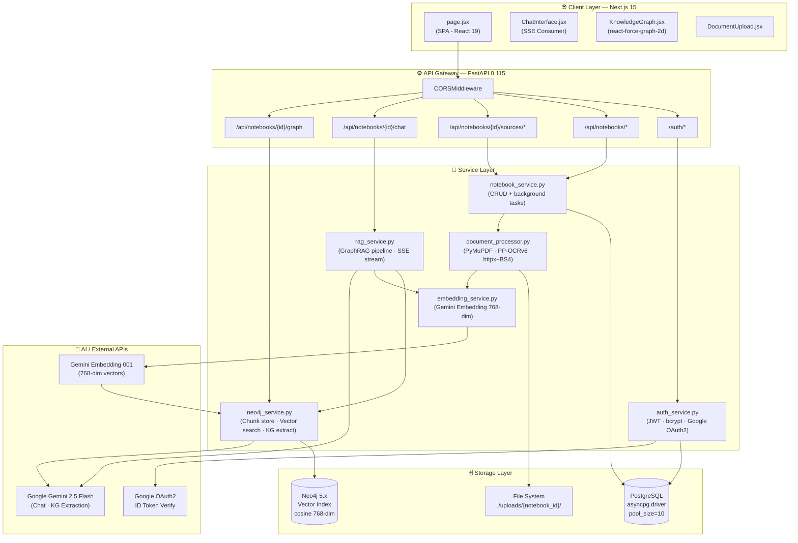
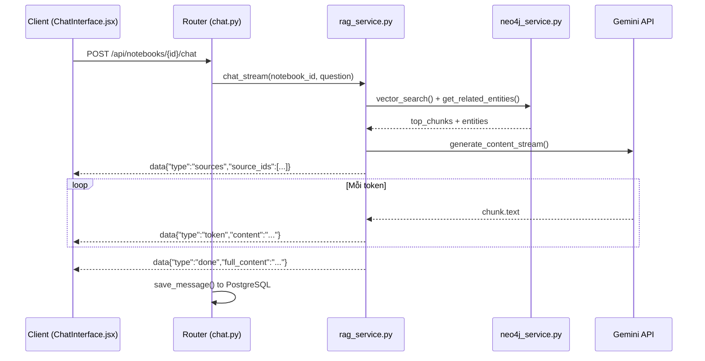
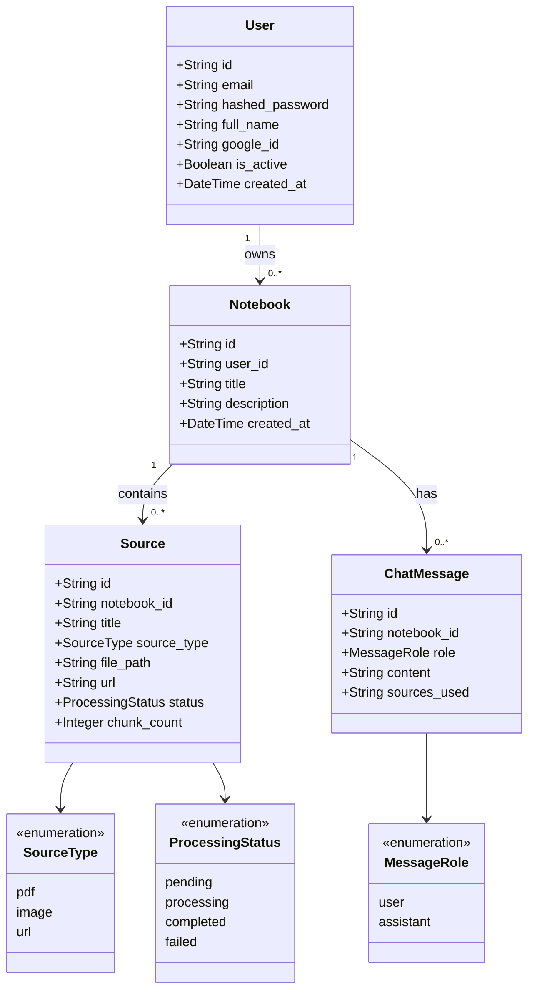
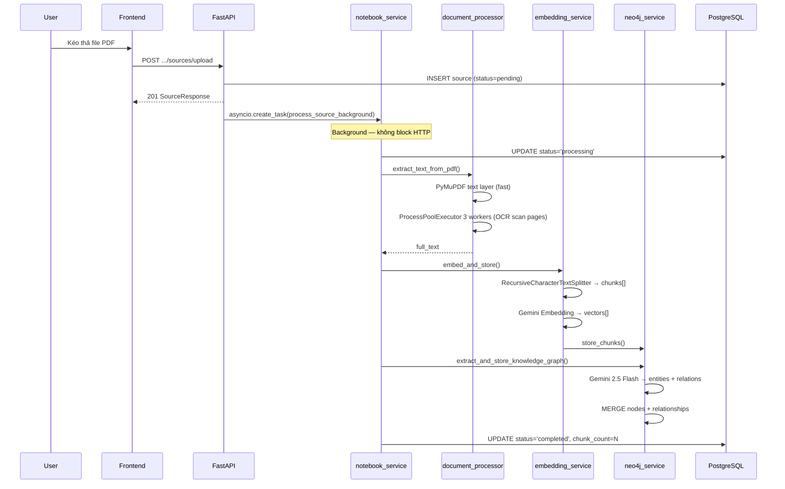
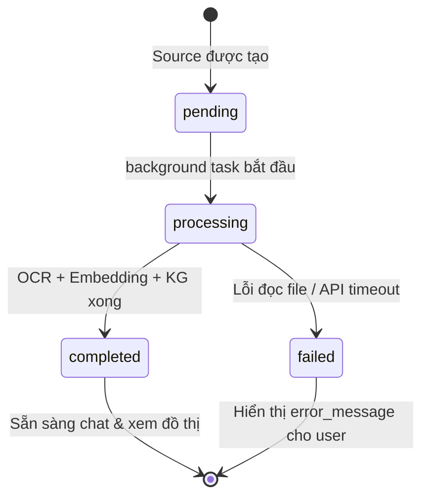

# Chương 5. AI trong Thiết kế & Kiến trúc Phần mềm
## Dự án: Skibidi — Nền Tảng Trích Xuất & Hỏi Đáp Tài Liệu Thông Minh

> Chương này trình bày quá trình ứng dụng Trí tuệ Nhân tạo (AI) vào từng tầng kiến trúc của hệ thống Skibidi: từ phân tích kiến trúc tổng thể, lựa chọn mô hình kiến trúc, mô hình hóa bằng UML, thiết kế cơ sở dữ liệu kép (PostgreSQL + Neo4j), đặc tả API RESTful, cho đến áp dụng các Design Pattern phù hợp với đặc thù xử lý AI bất đồng bộ.

---

## 5.1 Thiết kế Kiến trúc (Architecture Design)

### 5.1.1 Bối cảnh & Vai trò của AI trong Thiết kế Kiến trúc

Kiến trúc của Skibidi phải giải quyết đồng thời ba bài toán kỹ thuật phức tạp:

1. **Xử lý tài liệu nặng bất đồng bộ:** OCR song song nhiều trang PDF bằng PP-OCRv6 với `ProcessPoolExecutor`, không chặn luồng chính.
2. **Lưu trữ & truy vấn kép:** Dữ liệu quan hệ (user, notebook, source, chat) lưu vào **PostgreSQL** thông qua SQLAlchemy async; dữ liệu đồ thị (chunk, embedding, entity, relationship) lưu vào **Neo4j** thông qua driver async.
3. **Phản hồi thời gian thực:** Câu trả lời từ Gemini 2.5 Flash được truyền về client theo từng token qua **Server-Sent Events (SSE)** mà không cần WebSocket.

Nhóm phát triển đã sử dụng **Google Gemini 2.5 Flash** để phân tích các phương án kiến trúc, so sánh ưu/nhược điểm, và tư vấn lựa chọn stack phù hợp với ràng buộc: triển khai đơn máy chủ (single-host), không cần real-time collaboration ở MVP, ngân sách API thấp.

### 5.1.2 Kiến trúc Tổng thể Hệ thống



### 5.1.3 Quyết định Kiến trúc Quan trọng (Architecture Decision Records)

| ADR | Quyết định | Lý do | Đánh đổi |
|-----|-----------|-------|----------|
| **ADR-01** | Dùng FastAPI thay Django REST | ASGI native, async từ đầu, phù hợp SSE và background tasks | Ít plugin hơn Django |
| **ADR-02** | Dùng Neo4j thay pgvector | Lưu cả embedding vector lẫn đồ thị quan hệ trong cùng một node; Cypher query duyệt đồ thị tự nhiên | Phức tạp hơn, cần maintain 2 DB |
| **ADR-03** | SSE thay WebSocket cho chat streaming | Đơn giản hơn, HTTP/1.1 thuần, không cần persistent connection | Chỉ truyền server→client |
| **ADR-04** | Background task với `asyncio.create_task` | Zero-dependency, đủ cho MVP single-host | Không chịu được server restart; cần Celery nếu scale |
| **ADR-05** | JWT 7 ngày thay session | Stateless, phù hợp SPA | Không revoke được token ngay |

---

## 5.2 Các Mô hình Kiến trúc (Architecture Patterns)

### 5.2.1 Kiến trúc Phân lớp (Layered Architecture)

Backend được tổ chức thành **4 lớp rõ ràng**, mỗi lớp chỉ phụ thuộc vào lớp liền dưới:

```
┌─────────────────────────────────────────────────────────┐
│  LAYER 1: Presentation (Routers)                        │
│  auth.py · notebooks.py · sources.py · chat.py · graph.py│
│  Nhận HTTP request, validate input, trả HTTP response   │
├─────────────────────────────────────────────────────────┤
│  LAYER 2: Application (Services)                        │
│  auth_service · notebook_service · rag_service          │
│  Orchestrate business logic, không biết về HTTP         │
├─────────────────────────────────────────────────────────┤
│  LAYER 3: Domain / Infrastructure                       │
│  document_processor · embedding_service · neo4j_service │
│  Tích hợp AI APIs, OCR engine, database drivers         │
├─────────────────────────────────────────────────────────┤
│  LAYER 4: Data (Models + Schemas)                       │
│  SQLAlchemy ORM models · Pydantic schemas               │
│  Định nghĩa cấu trúc dữ liệu                            │
└─────────────────────────────────────────────────────────┘
```

### 5.2.2 Kiến trúc Hướng Sự Kiện (Event-Driven via SSE)

Luồng chat streaming áp dụng mô hình **push-based event stream**:



### 5.2.3 Kiến trúc Pipeline Xử Lý Tài Liệu (Pipeline Pattern)

Quá trình ingestion tài liệu tuân theo kiến trúc **Pipeline tuần tự với fallback**:

```
Input File/URL
    │
    ▼
[Stage 1] Phát hiện định dạng
    ├── PDF có text layer  →  PyMuPDF (fast path)
    ├── PDF scan / Image   →  PP-OCRv6 (parallel, 3 workers)
    └── URL                →  httpx + BeautifulSoup scraper
    │
    ▼
[Stage 2] Text Chunking
    →  RecursiveCharacterTextSplitter
    →  chunk_size=1000, chunk_overlap=200
    │
    ▼
[Stage 3] Dual Storage (song song)
    ├── Gemini Embedding 001 → Vector 768-dim → Neo4j Chunk nodes
    └── Gemini 2.5 Flash     → Entity/Relation  → Neo4j KG nodes
    │
    ▼
[Stage 4] Status Update
    →  PostgreSQL: source.status = "completed"
```

---

## 5.3 Mô hình hóa Hệ thống & UML

### 5.3.1 Biểu đồ Lớp (Class Diagram) — Domain Model



### 5.3.2 Sơ đồ Node/Relationship — Neo4j Graph Schema

```
(Notebook {id})
    │
    └─[:BELONGS_TO]── (Source {id, notebook_id})
                             │
                       [:PART_OF]
                             │
                       (Chunk {id, text, embedding[768], chunk_index})
                             │
                       [:MENTIONED_IN]
                             │
         (Entity: Person | Organization | Concept | Location | Event)
                  │
            [<RELATION_TYPE>]   ← tên quan hệ do Gemini sinh ra
                  │
         (Entity khác)
```

### 5.3.3 Biểu đồ Tuần tự — Luồng Nạp Tài Liệu



### 5.3.4 Biểu đồ Trạng thái — Vòng đời Tài liệu Source



---

## 5.4 Thiết kế Cơ sở Dữ liệu (Database Design)

### 5.4.1 Chiến lược Lưu trữ Kép (Polyglot Persistence)

| Tiêu chí | PostgreSQL | Neo4j |
|----------|-----------|-------|
| **Loại dữ liệu** | Quan hệ có cấu trúc | Đồ thị + Vector |
| **Truy vấn đặc trưng** | JOIN, filter, aggregation | Vector similarity, graph traversal |
| **Driver** | `asyncpg` via SQLAlchemy 2.0 | `neo4j` Python async driver |
| **Connection pool** | pool_size=10, max_overflow=20 | Singleton AsyncGraphDatabase |
| **Indexing** | B-tree index trên FK columns | HNSW Vector Index (cosine, 768-dim) |

### 5.4.2 Lược đồ Quan hệ PostgreSQL (ERD)

```
┌──────────────────────────────────────────────────────────┐
│  users                                                    │
│  PK  id              VARCHAR(36)                          │
│      email           VARCHAR(255) UNIQUE NOT NULL         │
│      hashed_password VARCHAR(255)                         │
│      full_name       VARCHAR(255)                         │
│      google_id       VARCHAR(255) UNIQUE                  │
│      is_active       BOOLEAN DEFAULT TRUE                 │
│      created_at      TIMESTAMP WITH TIMEZONE              │
│      updated_at      TIMESTAMP WITH TIMEZONE              │
└──────────────────────┬───────────────────────────────────┘
                       │ 1 : N  (CASCADE DELETE)
┌──────────────────────▼───────────────────────────────────┐
│  notebooks                                                │
│  PK  id          VARCHAR(36)                              │
│  FK  user_id  →  users.id                                 │
│      title       VARCHAR(255) NOT NULL                    │
│      description TEXT                                     │
│      created_at  TIMESTAMP WITH TIMEZONE                  │
│      updated_at  TIMESTAMP WITH TIMEZONE                  │
│  INDEX: (user_id)                                         │
└──────────┬───────────────────────────┬───────────────────┘
           │ 1 : N (CASCADE)           │ 1 : N (CASCADE)
┌──────────▼───────────────┐  ┌────────▼────────────────────┐
│  sources                  │  │  chat_messages              │
│  PK  id          VCH(36)  │  │  PK  id           VCH(36)  │
│  FK  notebook_id → nb.id  │  │  FK  notebook_id → nb.id   │
│      title    VCH(512)    │  │      role  ENUM(user,asst)  │
│      source_type ENUM     │  │      content      TEXT      │
│        (pdf,image,url)    │  │      sources_used TEXT(JSON)│
│      file_path  VCH(1024) │  │      created_at   TIMESTAMP │
│      url        TEXT      │  └─────────────────────────────┘
│      status     ENUM      │
│      (pending,processing, │
│       completed,failed)   │
│      error_message TEXT   │
│      chunk_count INTEGER  │
│      created_at TIMESTAMP │
│  INDEX: (notebook_id)     │
└───────────────────────────┘
```

### 5.4.3 Vector Index Neo4j

```cypher
-- Khởi tạo vector index khi startup
CREATE VECTOR INDEX chunk_vector_index IF NOT EXISTS
FOR (c:Chunk) ON (c.embedding)
OPTIONS {indexConfig: {
    `vector.dimensions`: 768,
    `vector.similarity_function`: 'cosine'
}}

-- Truy vấn vector similarity
CALL db.index.vector.queryNodes('chunk_vector_index', 5, $query_embedding)
YIELD node AS c, score
MATCH (c)-[:PART_OF]->(s:Source)-[:BELONGS_TO]->(n:Notebook {id: $notebook_id})
RETURN c.text, c.source_id, score
ORDER BY score DESC
```

### 5.4.4 Chiến lược Khởi tạo Schema

| Cơ sở dữ liệu | Cách khởi tạo | Ghi chú |
|----------------|--------------|---------|
| **PostgreSQL** | `Base.metadata.create_all` lúc startup | Auto-create, không dùng Alembic ở MVP |
| **Neo4j Vector Index** | `init_vector_index()` lúc startup | SHOW INDEXES trước, CREATE IF NOT EXISTS |

---

## 5.5 Thiết kế API (API Design)

### 5.5.1 Nguyên tắc Thiết kế

- **RESTful** với resource-based URL, HTTP verbs chuẩn
- **Nested routes** phản ánh ownership: `/api/notebooks/{id}/sources/{source_id}`
- **JWT Bearer** cho tất cả endpoint bảo mật
- **Pydantic v2** cho input/output validation & serialization
- **StreamingResponse** (`text/event-stream`) cho chat endpoint

### 5.5.2 Bảng Đặc tả API Đầy đủ

#### 🔐 Authentication

| Method | Endpoint | Mô tả | Auth | Body | Response |
|--------|----------|-------|------|------|---------|
| `POST` | `/auth/register` | Đăng ký tài khoản | ❌ | `{email, password, full_name}` | `{access_token, user}` |
| `POST` | `/auth/login` | Đăng nhập email/pass | ❌ | `{email, password}` | `{access_token, user}` |
| `POST` | `/auth/google` | Google OAuth2 | ❌ | `{id_token}` | `{access_token, user}` |
| `GET`  | `/auth/me` | Thông tin user hiện tại | ✅ JWT | — | `User` |

#### 📁 Notebooks

| Method | Endpoint | Mô tả | Auth | Body | Response |
|--------|----------|-------|------|------|---------|
| `GET`    | `/api/notebooks` | Danh sách notebooks | ✅ | — | `Notebook[]` |
| `POST`   | `/api/notebooks` | Tạo notebook | ✅ | `{title, description?}` | `Notebook` 201 |
| `GET`    | `/api/notebooks/{id}` | Chi tiết notebook | ✅ | — | `Notebook` |
| `PATCH`  | `/api/notebooks/{id}` | Cập nhật | ✅ | `{title?, description?}` | `Notebook` |
| `DELETE` | `/api/notebooks/{id}` | Xóa notebook | ✅ | — | `204` |

#### 📄 Sources

| Method | Endpoint | Mô tả | Auth | Body | Response |
|--------|----------|-------|------|------|---------|
| `GET`    | `.../sources` | Danh sách sources | ✅ | — | `Source[]` |
| `POST`   | `.../sources/upload` | Upload PDF/ảnh (≤50MB) | ✅ | `multipart: file` | `Source` 201 |
| `POST`   | `.../sources/url` | Thêm URL | ✅ | `{url, title?}` | `Source` 201 |
| `DELETE` | `.../sources/{id}` | Xóa source | ✅ | — | `204` |
| `GET`    | `.../sources/{id}/file` | Tải file gốc | ✅ | — | `FileResponse` |

#### 💬 Chat

| Method | Endpoint | Mô tả | Auth | Body | Response |
|--------|----------|-------|------|------|---------|
| `GET`  | `.../chat` | Lịch sử chat | ✅ | — | `ChatMessage[]` |
| `POST` | `.../chat` | Gửi câu hỏi (SSE) | ✅ | `{message}` | `text/event-stream` |

**SSE Event Schema:**

```json
// Sự kiện 1: danh sách nguồn tài liệu dùng để trả lời
data: {"type": "sources", "source_ids": ["uuid-1", "uuid-2"]}

// Sự kiện 2..N: token từng chữ từ Gemini
data: {"type": "token", "content": "Dựa trên tài liệu"}

// Sự kiện cuối: hoàn thành + toàn bộ nội dung
data: {"type": "done", "full_content": "Dựa trên tài liệu..."}
```

#### 🕸️ Knowledge Graph

| Method | Endpoint | Mô tả | Auth | Response |
|--------|----------|-------|------|---------|
| `GET` | `.../graph` | Nodes + Edges của notebook | ✅ | `{nodes[], edges[]}` |

```json
{
  "nodes": [{"id": "PP-OCRv6", "label": "PP-OCRv6", "type": "Concept"}],
  "edges": [{"source": "PP-OCRv6", "target": "OpenVINO", "label": "ACCELERATED_BY"}]
}
```

### 5.5.3 Mã Lỗi Chuẩn hóa

| HTTP Status | Tình huống |
|-------------|-----------|
| `400 Bad Request` | Input không hợp lệ (email sai, định dạng file không hỗ trợ) |
| `401 Unauthorized` | Token hết hạn, sai, hoặc không có |
| `404 Not Found` | Notebook / Source không tồn tại hoặc không thuộc user |
| `413 Payload Too Large` | File vượt quá 50MB |
| `500 Internal Server Error` | Lỗi server nội bộ |

---

## 5.6 Mô hình Thiết kế (Design Patterns)

### 5.6.1 Singleton Pattern — Lazy-initialized Heavy Clients

Các client nặng được khởi tạo **một lần duy nhất** theo mô hình lazy singleton, tránh overhead khi import module:

```python
# neo4j_service.py
_driver = None

def get_neo4j_driver():
    global _driver
    if _driver is None:
        _driver = AsyncGraphDatabase.driver(
            settings.neo4j_uri,
            auth=(settings.neo4j_username, settings.neo4j_password),
        )
    return _driver

# document_processor.py
_paddle_ocr = None

def _get_paddle_ocr():
    global _paddle_ocr
    if _paddle_ocr is None:
        from paddleocr import PaddleOCR       # import trễ
        _paddle_ocr = PaddleOCR(use_angle_cls=True, lang="vi", ...)
    return _paddle_ocr

# embedding_service.py
_embedder = None

def get_embedder() -> GoogleGenerativeAIEmbeddings:
    global _embedder
    if _embedder is None:
        _embedder = GoogleGenerativeAIEmbeddings(
            model=settings.embedding_model,
            google_api_key=settings.gemini_api_key,
        )
    return _embedder
```

### 5.6.2 Repository Pattern — Service Layer Abstraction

`notebook_service.py` đóng vai trò **Repository**, tập trung tất cả CRUD với PostgreSQL. Router chỉ gọi service, không bao giờ gọi thẳng SQLAlchemy:

```python
# notebook_service.py
async def get_notebook(db: AsyncSession, notebook_id: str, user_id: str) -> Notebook | None:
    result = await db.execute(
        select(Notebook).where(
            Notebook.id == notebook_id,
            Notebook.user_id == user_id   # đảm bảo ownership
        )
    )
    return result.scalar_one_or_none()

async def create_file_source(db, notebook_id, title, file_path, source_type) -> Source: ...
async def process_source_background(db, source: Source) -> None: ...  # Orchestrator
async def save_message(db, notebook_id, role, content, sources_used=None) -> ChatMessage: ...
```

### 5.6.3 Strategy Pattern — Chiến lược Trích xuất Tài liệu

`document_processor.py` áp dụng **Strategy Pattern** chọn phương pháp xử lý phù hợp với định dạng đầu vào, kèm fallback tự động:

```python
async def process_document(file_path: str, source_type: str) -> str:
    if source_type == "pdf":
        return await extract_text_from_pdf(file_path)   # Strategy A
    elif source_type == "image":
        return await extract_text_from_image(file_path) # Strategy B

async def extract_text_from_pdf(file_path: str) -> str:
    # Sub-strategy: text layer (nhanh) hoặc OCR parallel (chậm)
    for page in doc:
        text = page.get_text().strip()
        if text:
            pages_text.append((i, text))       # Fast path
        else:
            needs_ocr_pages.append(i)          # OCR path

    # OCR parallel 3 workers cho trang scan
    with ProcessPoolExecutor(max_workers=3) as executor:
        ocr_results = await loop.run_in_executor(None, ...)
```

### 5.6.4 Generator / Iterator Pattern — SSE Streaming

`rag_service.py` dùng **AsyncGenerator** để yield từng SSE event ngay khi Gemini sinh ra token, không buffer toàn bộ câu trả lời:

```python
async def chat_stream(
    notebook_id: str,
    question: str,
    chat_history: list[dict] | None = None,
) -> AsyncGenerator[str, None]:
    # 1. Embed query, 2. Vector search, 3. KG traversal, 4. Build context
    ...

    # Yield source IDs trước
    yield f"data: {json.dumps({'type': 'sources', 'source_ids': source_ids})}\n\n"

    # Yield từng token từ Gemini stream
    async for chunk in await client.aio.models.generate_content_stream(...):
        if chunk.text:
            yield f"data: {json.dumps({'type': 'token', 'content': chunk.text})}\n\n"

    yield f"data: {json.dumps({'type': 'done', 'full_content': full_response})}\n\n"
```

### 5.6.5 Facade Pattern — GraphRAG Context Builder

`rag_service._build_context()` là **Facade** che giấu sự phức tạp của việc kết hợp kết quả Vector Search và Knowledge Graph traversal thành một context string duy nhất:

```python
def _build_context(chunks: list[dict], entities: list[dict]) -> str:
    """Facade: hợp nhất Vector chunks + KG triples → prompt context cho Gemini."""
    context_parts = []
    if chunks:
        context_parts.append("=== Đoạn văn bản liên quan ===")
        for i, chunk in enumerate(chunks, 1):
            context_parts.append(f"[{i}] {chunk['text']}")

    if entities:
        context_parts.append("\n=== Thông tin từ Đồ thị Tri thức ===")
        seen = set()
        for e in entities:
            if e.get("relation") and e.get("entity") and e.get("target"):
                triple = f"{e['entity']} —[{e['relation']}]→ {e['target']}"
                if triple not in seen:
                    context_parts.append(triple)
                    seen.add(triple)

    return "\n".join(context_parts)
```

### 5.6.6 Dependency Injection — FastAPI Depends

FastAPI `Depends()` thực hiện **DI** để inject database session và authenticated user vào mọi endpoint, giữ cho router code sạch gọn:

```python
@router.post("/{notebook_id}/chat")
async def chat(
    notebook_id: str,
    body: ChatRequest,
    db: AsyncSession = Depends(get_db),         # Inject: async DB session
    current_user = Depends(get_current_user),    # Inject: authenticated user
):
    nb = await notebook_service.get_notebook(db, notebook_id, current_user.id)
    if not nb:
        raise HTTPException(404, "Notebook không tồn tại")
    ...
```

---

## 5.7 Tổng kết Chương 5

| Khía cạnh | Quyết định Thiết kế | Giá trị mang lại |
|-----------|--------------------|----|
| **Kiến trúc tổng thể** | Layered + Event-driven SSE + Pipeline ingestion | Tách biệt mối quan tâm, dễ mở rộng từng lớp |
| **Mô hình kiến trúc** | 4-tier layers, Pipeline fallback, Push streaming | Không block luồng chính, xử lý lỗi tự động |
| **Mô hình hóa UML** | Class, Sequence, State Diagram chuẩn hóa | Tài liệu hóa đầy đủ cho handover & bảo trì |
| **Cơ sở dữ liệu** | Polyglot Persistence (PostgreSQL + Neo4j) | Tối ưu truy vấn theo đặc thù từng loại dữ liệu |
| **Thiết kế API** | RESTful + Nested routes + SSE streaming | Trực quan, dễ tích hợp frontend |
| **Design Patterns** | Singleton, Repository, Strategy, Generator, Facade, DI | Code sạch, tái sử dụng cao, dễ kiểm thử |

Kiến trúc này tạo nền tảng kỹ thuật vững chắc để chương 6 hiện thực hóa chi tiết từng module và kiểm thử hiệu năng toàn diện.
